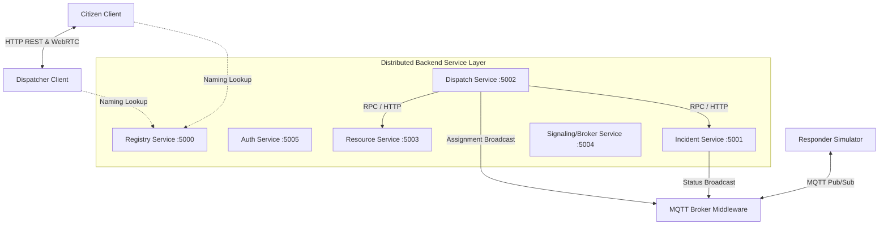

# DERRCS: Distributed Emergency Response & Resource Coordination System

DERRCS is a distributed emergency dispatch and response simulation dashboard designed to address distributed system design challenges under emergency constraint conditions. The application enables real-time peer-to-peer multimedia calling, atomic capacity allocation, naming registries, dynamic service lookups, and fault-tolerant edge updates.

This project is submitted in fulfillment of the **Distributed Systems Course Project Evaluation (FA-1)** requirements.

---

## 🏛️ System Architecture

DERRCS is structured around a decentralized **stateless microservices architecture** that coordinates state over a lightweight messaging middleware.



---

## 🛠️ Feature-to-Concept Mapping

This table connects DERRCS application features to the theoretical Distributed Systems concepts they demonstrate:

| Application Feature | Distributed Systems Concept Applied | syllabus unit |
| :--- | :--- | :--- |
| **Dynamic Service Lookup** | **Names, Identifiers & Addresses**: The `registry-service` dynamically maps logical names (e.g., `incident-service`) to active HTTP addresses. | Unit 2 (Self-Study) |
| **Live Telemetry & GPS Map** | **Message-Oriented Communication & Migration Transparency**: Responders update coordinates over MQTT topics dynamically, while maintaining a constant identifier (UUID). | Unit 2 / Unit 1 |
| **Emergency Dispatch Allocation** | **Remote Procedure Calls (RPC)**: Synchronous inter-service API orchestration where `dispatch-service` issues claims/status patches on other microservices. | Unit 2 |
| **Live Video/Audio Call** | **Stream-Oriented Communication & Multimedia Systems**: Estabishes peer-to-peer media streaming directly between Citizen and Operator browsers via WebRTC. | Unit 2 / Unit 1 |
| **Atomic Capacity Locks** | **Concurrency**: Prevents race conditions during simultaneous assignments using MongoDB conditional operators (`availableCount: { $gt: 0 }`). | Unit 1 |
| **Write-Ahead Queue & P2P Relay** | **Fault Tolerance & P2P Messaging**: Responder caches updates in a local queue when offline and broadcasts them via simulated P2P relays. | Unit 2 |

---

## 🎯 Mapping Distributed Systems Concepts (FA-1 Syllabus)

DERRCS implements key concepts from **Unit 1** and **Unit 2** of the Distributed Systems curriculum:

### **Unit 1: Introduction to Distributed Systems**

| Concept | DERRCS Implementation Detail |
| :--- | :--- |
| **System Architecture** | Decoupled client-server and microservice architecture consisting of 6 containerized, stateless backend services interacting with a web frontend. |
| **Location Transparency** | Managed by the **Naming Registry** (`registry-service`). Services register their dynamic endpoint address (IP/Port), and clients lookup bindings dynamically rather than using hardcoded links. |
| **Migration Transparency** | IoT mobile resources (ambulances, patrol units) change coordinates frequently in the physical simulation but maintain their constant unique identifier (UUID) throughout the system lifecycle. |
| **Concurrency Control** | Solved using **atomic capacity claims** inside the `resource-service` database layers. MongoDB queries atomically update capacity to prevent dual-allocations when multiple operators assign the same resource simultaneously. |
| **Distributed Multimedia** | Real-time audio/video emergency pipelines establish direct media loops between the `Citizen` (camera feed) and `Dispatcher` operator tabs using WebRTC. |
| **Role of Virtualization** | Every component runs inside isolated virtualization nodes using **Docker** containers managed by `docker-compose`. |

### **Unit 2: Communication**

| Concept | DERRCS Implementation Detail |
| :--- | :--- |
| **Fundamentals of Communication** | Integrates synchronous request-response protocols (**HTTP/1.1 REST**) for deterministic actions (auth, incident registration) and low-latency full-duplex persistent connections (**WebSockets**) for state updates. |
| **Remote Procedure Call (RPC)** | Implemented via HTTP/REST inter-service communications using `axios` (e.g., `dispatch-service` invoking remote endpoints on `resource-service` and `incident-service` dynamically resolved from the registry). |
| **Message-Oriented Communication** | High-frequency telemetry coordinates (`location`) and broadcast updates (`assignment`) are routed asynchronously over an **MQTT Message Broker** (Aedes middleware) on topics like `responders/+/location`. |
| **WebRTC & P2P Messaging** | Handshakes are negotiated over the broker signaling server using a robust peer-joined handshake. Responders also simulate local write-ahead logs to cache coordinates when offline and relay them via peer-to-peer lookup. |
| **Names & Identifiers** | The registry service maps logical names (e.g. `resource-service`) to dynamic address values. Identifiers for incidents (`inc-<timestamp>`) and responders are consistently mapped. |
| **Fault Tolerance** | Designed with write-ahead local queue buffers. When a field unit loses connection (`isOffline`), coordinates are saved locally and flushed chronologically when connection is restored. |

---

## 🚀 Running the System

### Prerequisites
- Node.js (v18+)
- Docker and Docker Compose

### Option 1: Docker Compose (All Services Virtualized)
To spin up all services, databases, and brokers inside virtualized containers:
```bash
docker-compose up --build
```
Access the frontend console at `http://localhost:5173`.

### Option 2: Local Development (Concurrent Scripts)
To run in local development mode with hot-reloading:
1. Install root dependencies:
   ```bash
   npm install
   ```
2. Run concurrently:
   ```bash
   npm run dev
   ```

---

## 🔮 Future Expansion (FA-2 Plan)
For the FA-2 evaluation, the project will extend these abstractions to incorporate **Unit 3 (Synchronization & Consistency)** and **Unit 4 (Fault Tolerance & Security)**:
- **Logical Clocks (Lamport/Vector)** to order local write-ahead log events relayed via P2P.
- **Distributed Mutual Exclusion Algorithms** for cross-registry locking.
- **Primary-Backup Replication** for high-availability database state.
